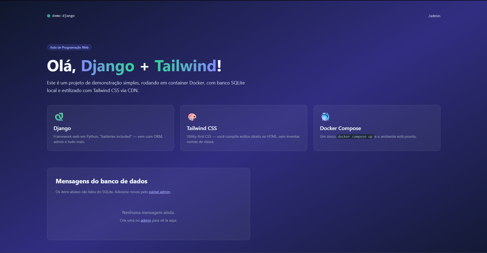

# 🚀 Django + Tailwind CSS: Modelos e Relacionamentos (1:N)

Este repositório contém a segunda etapa do projeto `demo-django`. O objetivo desta fase foi aprofundar os conhecimentos no ORM do Django, implementando um relacionamento **Um-para-Muitos (1:N)** no banco de dados, além de estilizar os novos componentes dinâmicos utilizando o Tailwind CSS.

O projeto roda inteiramente em um container **Docker**, garantindo que o ambiente seja idêntico para qualquer desenvolvedor.

---

## 🛠️ Tecnologias Utilizadas

- **Framework Web:** Django (Python)
- **Banco de Dados:** SQLite
- **Estilização:** Tailwind CSS (via CDN)
- **Ambiente:** Docker & Docker Compose

---

## 🧠 O Que Foi Aprendido Nesta Etapa

- **Modelagem baseada em relacionamentos:** criação do model `Categoria` e associação com o model `Mensagem` através de uma chave estrangeira (`ForeignKey`).
- **Comportamento de remoção (`on_delete`):** configuração do parâmetro `models.SET_NULL` para garantir a integridade dos dados e evitar que mensagens sejam apagadas caso sua categoria seja removida.
- **Customização do Django Admin:** registro de novos modelos no painel administrativo, inclusão de colunas de exibição (`list_display`) e criação de filtros laterais baseados no relacionamento (`list_filter`).
- **Consultas do ORM em templates:** navegação por tabelas relacionadas (`{{ mensagem.categoria.nome }}`) com renderização condicional utilizando ``.
- **Relacionamento reverso (Reverse Lookup):** uso do `related_name="mensagens"` para consultar dados a partir do elemento pai (ex.: `categoria.mensagens.all()`) utilizando o Django Shell.

---

## 🚀 Como Executar o Projeto

Certifique-se de ter o **Docker** e o **Docker Compose** instalados em sua máquina.

### 1. Subir o container e iniciar o servidor

Para construir a imagem e iniciar a aplicação, execute:

```bash
docker compose up --build
```

O servidor estará disponível em:

```text
http://localhost:8000
```

### 2. Gerar e aplicar as migrações no banco

Com o container em execução, abra um novo terminal e execute:

```bash
docker compose run --rm web python manage.py makemigrations
docker compose run --rm web python manage.py migrate
```

### 3. Acessar o Painel Administrativo

Para cadastrar categorias e gerenciar as mensagens, acesse:

```text
http://localhost:8000/admin/
```

### Página Inicial



### Painel admin (Categorias)


### Painel admin (Mensagens)


## 💡 Sobre o Projeto

Este projeto faz parte do meu portfólio de estudos em desenvolvimento backend com Python e Django, com foco em modelagem de dados, ORM, Docker e boas práticas de desenvolvimento web.
