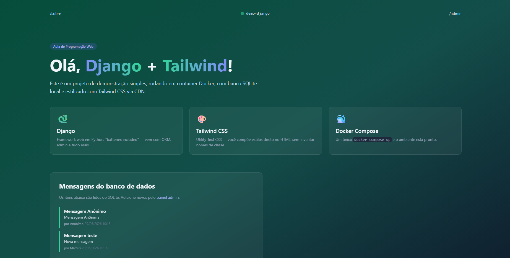
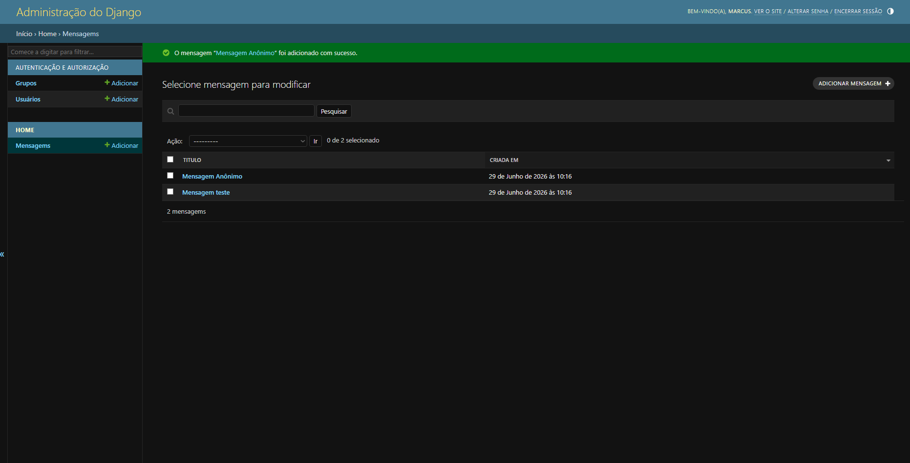
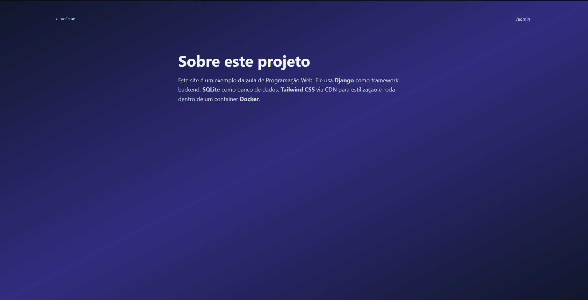

# Demo Django + Tailwind + Docker 🐳 — Parte II: Modelos e Rotas

Este projeto é a evolução da demonstração prática de uma aplicação web utilizando **Django 5.1**, **Tailwind CSS** (via CDN) e **Docker**. Nesta etapa, a aplicação foi expandida para incluir o gerenciamento dinâmico de dados através do painel administrativo do Django, evolução de esquemas de banco de dados (_migrations_), novas rotas de navegação e a implementação do padrão arquitetural **MTV**.

O projeto faz parte das atividades práticas da disciplina de Programação Web.

---

## 🚀 Novas Implementações e Tecnologias

- **Evolução do Modelo de Dados:** Adicionado o campo `autor` ao modelo `Mensagem` com tratamento de valores padrões (`default`).
- **Gerenciamento de Migrations:** Utilização prática dos comandos `makemigrations` e `migrate` para atualizar o banco de dados SQLite dentro do container.
- **Sistema de Rotas Múltiplas:** Criação de uma nova página estática (`/sobre/`) com navegação integrada entre templates utilizando a arquitetura de URLs do Django.
- **Arquitetura MTV (Model-Template-View):** Consolidação do fluxo de requisições unindo dados estruturados, lógica em Python e apresentação visual.

---

## 📸 Demonstração da Aplicação

### Página Inicial (Com Mensagens e Autor)

### Cadastro de Mensagem no Painel Admin

### Nova Página "Sobre"

---
