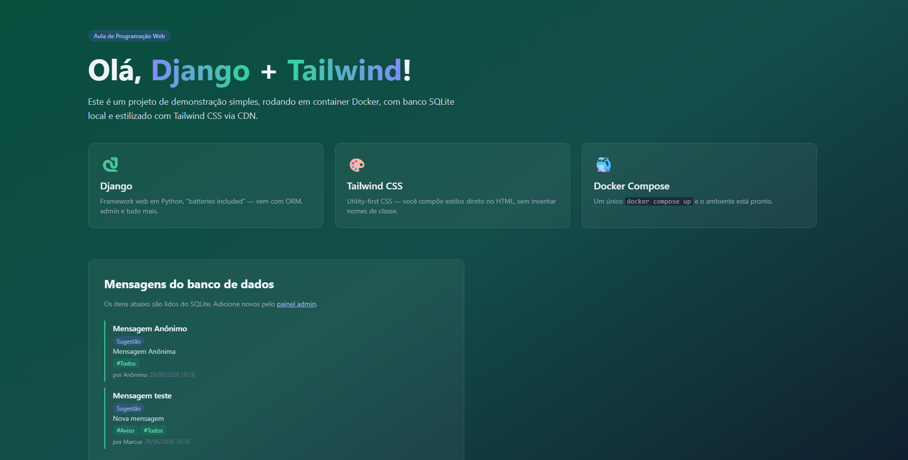
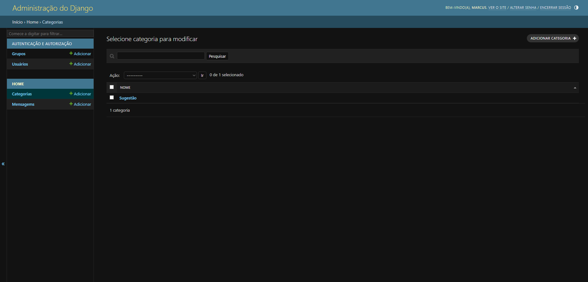

# 🚀 Django + Tailwind CSS: Formulários HTML, Segurança e Ciclo CRUD (Create)

Este repositório contém a quinta etapa do projeto `demo-django`. O objetivo desta fase foi abrir a aplicação para a interação do usuário comum, implementando a operação de **Criação (Create)** do ciclo CRUD diretamente na página pública por meio de formulários dinâmicos, deixando de depender exclusivamente do painel administrativo ou do terminal.

O ambiente continua totalmente isolado e configurado via **Docker**.

---

## 🛠️ Tecnologias Utilizadas

- **Framework Web:** Django (Python)
- **Banco de Dados:** SQLite
- **Estilização:** Tailwind CSS (via CDN)
- **Ambiente:** Docker & Docker Compose

---

## 📸 Screenshots

### Página Inicial



---

### Formulário de Criação



---

## 🧠 O Que Foi Aprendido Nesta Etapa

- **Ciclo CRUD e Métodos HTTP:** compreensão prática da diferença entre requisições **GET** (renderização do formulário) e **POST** (envio e processamento dos dados).
- **Formulários Automatizados (`ModelForm`):** geração e validação de formulários HTML diretamente a partir dos modelos do Django, incluindo personalização através de `widgets`.
- **Segurança na Web (CSRF):** implementação da tag `` para proteção contra ataques do tipo _Cross-Site Request Forgery_.
- **Padrão Post/Redirect/Get (PRG):** utilização de `redirect()` após o processamento do formulário para evitar submissões duplicadas.
- **Processamento Manual de Relacionamentos N:N:** captura de texto livre, separação de tags por vírgulas, uso de `slugify` e reaproveitamento de registros com `get_or_create()`.
- **Mensagens Temporárias (Flash Messages):** utilização do framework `django.contrib.messages` para exibir feedback ao usuário após operações realizadas.

---

## 🚀 Como Executar o Projeto

Certifique-se de ter o **Docker** e o **Docker Compose** instalados em sua máquina.

### 1. Subir o container e iniciar o servidor

Para construir a imagem e iniciar a aplicação, execute:

```bash
docker compose up --build
```

A aplicação estará disponível em:

```text
http://localhost:8000
```

### 2. Acessar a aplicação

Abra o navegador e acesse:

```text
http://localhost:8000
```

A partir desta etapa, novas mensagens podem ser criadas diretamente pela interface pública da aplicação.

---

## 🔄 Fluxo de Criação de Mensagens

1. O usuário acessa o formulário através de uma requisição **GET**.
2. O Django renderiza o formulário utilizando um `ModelForm`.
3. O usuário preenche os campos e envia os dados através de uma requisição **POST**.
4. O servidor valida as informações recebidas.
5. As tags são processadas e associadas à mensagem.
6. Uma mensagem de sucesso é exibida.
7. O usuário é redirecionado para evitar reenvios acidentais do formulário.

---

## 💡 Sobre o Projeto

Este projeto faz parte do meu portfólio de estudos em desenvolvimento backend com Python e Django, com foco em desenvolvimento web, modelagem de dados, segurança de aplicações e boas práticas de construção de sistemas.
