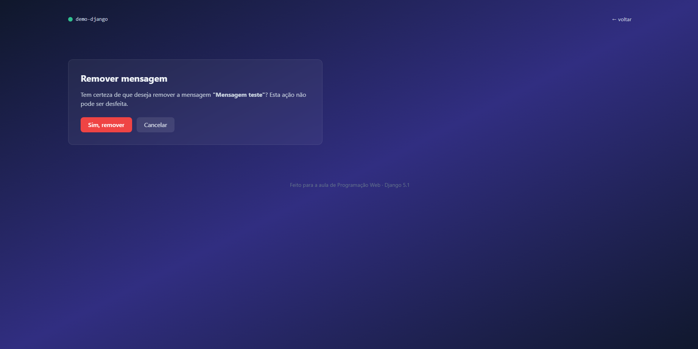

# 🚀 Django + Tailwind CSS: Finalizando o Ciclo CRUD (Update & Delete)

Este repositório contém a sexta e última etapa do projeto de evolução `demo-django`. O objetivo central desta fase foi consolidar as operações do ciclo de persistência, adicionando as capacidades de **Atualização (Update)** e **Exclusão (Delete)** de registros na interface pública através de parâmetros dinâmicos de rotas e reuso inteligente de código.

O ambiente de desenvolvimento segue componentizado e isolado via **Docker**.

> 💡 Esta etapa conclui o ciclo essencial de manipulação de dados, mapeamento de rotas, formulários e segurança utilizando o ecossistema nativo do Django Framework.

---

## 🛠️ Tecnologias Utilizadas

- **Framework Web:** Django (Python)
- **Banco de Dados:** SQLite
- **Estilização:** Tailwind CSS (via CDN)
- **Ambiente:** Docker & Docker Compose

---

## 📸 Screenshots

### Página Inicial


---

### Edição de Mensagem


---

### Confirmação de Exclusão



---

## 🧠 O Que Foi Aprendido Nesta Etapa

- **Parâmetros de rota (Path Converters):** captura dinâmica de identificadores através de URLs como `<int:id>`.
- **Resiliência e segurança (`get_object_or_404`):** tratamento automático de registros inexistentes com resposta HTTP 404.
- **Reuso de formulários com `instance`:** utilização do mesmo `ModelForm` para criação e edição de registros.
- **Refatoração com o princípio DRY:** extração da lógica de processamento de tags para uma função reutilizável.
- **Sincronização de relacionamentos N:N:** uso de `.clear()` para remover associações antigas antes de aplicar novas tags.
- **Exclusões seguras:** implementação de fluxo de confirmação utilizando requisições `POST` protegidas por CSRF.

---

## 🔄 Visão Geral do Ciclo CRUD Concluído

| Letra | Operação | Método HTTP | Rota (URL)                 | Interface                             |
| :---: | -------- | :---------: | -------------------------- | ------------------------------------- |
| **C** | Create   |   `POST`    | `/nova/`                   | Formulário público (`nova.html`)      |
| **R** | Read     |    `GET`    | `/`                        | Página inicial (`index.html`)         |
| **U** | Update   |   `POST`    | `/mensagens/<id>/editar/`  | Formulário preenchido (`editar.html`) |
| **D** | Delete   |   `POST`    | `/mensagens/<id>/remover/` | Tela de confirmação (`remover.html`)  |

---

## 🚀 Como Executar o Projeto

Certifique-se de ter o **Docker** e o **Docker Compose** instalados em sua máquina.

### 1. Subir o container e iniciar o servidor

Execute:

```bash id="rn4g8x"
docker compose up --build
```

A aplicação estará disponível em:

```text id="0vlvhj"
http://localhost:8000
```

### 2. Aplicar as migrações

Caso esteja executando o projeto pela primeira vez:

```bash id="ygcth4"
docker compose run --rm web python manage.py makemigrations
docker compose run --rm web python manage.py migrate
```

### 3. Acessar a aplicação

Abra o navegador e acesse:

```text id="tfjmb8"
http://localhost:8000
```

---

## 🧪 Funcionalidades Disponíveis

Após concluir todas as etapas do projeto, a aplicação permite:

- Criar novas mensagens.
- Visualizar mensagens cadastradas.
- Editar mensagens existentes.
- Remover mensagens com confirmação.
- Gerenciar categorias e tags.
- Utilizar relacionamentos **1:N** e **N:N** através do ORM do Django.
- Receber feedback visual por meio de mensagens temporárias (_flash messages_).

---

## 🏁 Conclusão

Ao final desta etapa, a aplicação implementa integralmente o ciclo **CRUD (Create, Read, Update e Delete)** utilizando recursos nativos do Django, incluindo:

- ORM e relacionamentos entre modelos.
- Formulários automatizados com `ModelForm`.
- Validação e proteção CSRF.
- Rotas dinâmicas.
- Mensagens temporárias.
- Reaproveitamento de código e boas práticas de desenvolvimento.

Este projeto representa uma base sólida para aplicações web mais complexas construídas com Django.

---

## 💡 Sobre o Projeto

Este projeto faz parte do meu portfólio de estudos em desenvolvimento backend com Python e Django, com foco em desenvolvimento web, modelagem de dados, ORM, segurança e boas práticas de engenharia de software.
